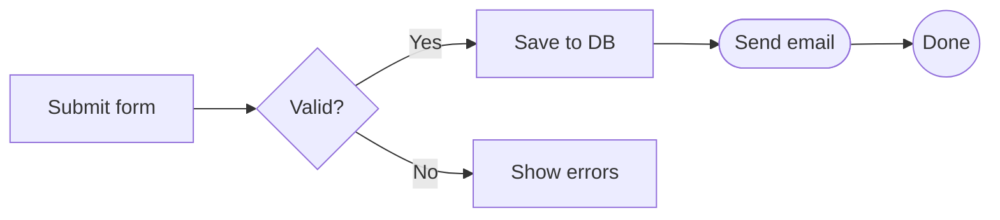
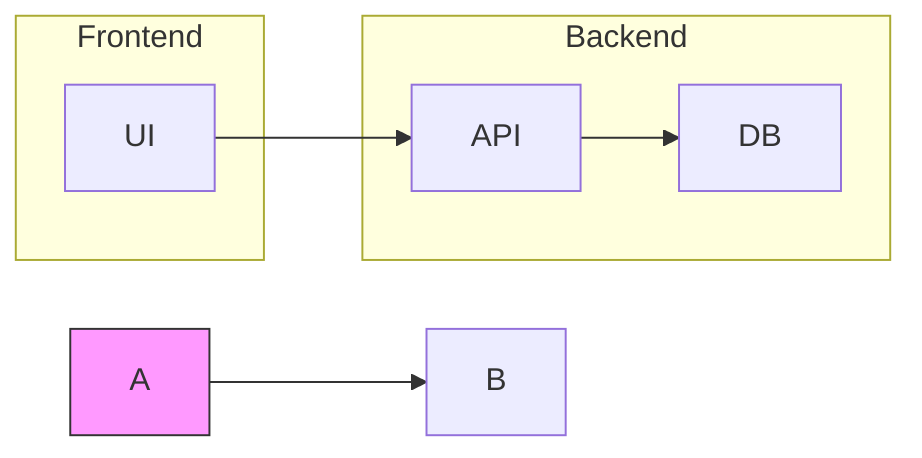
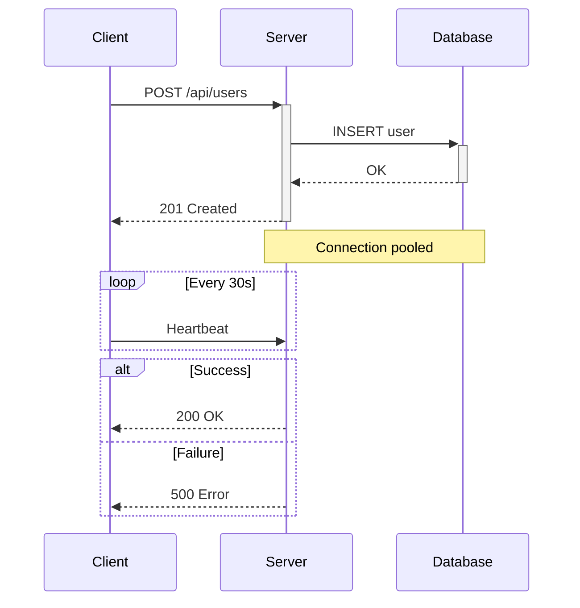
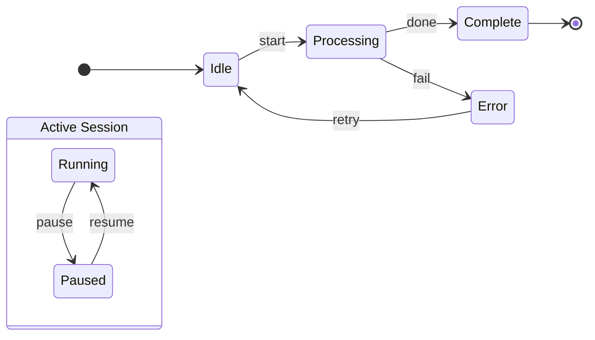
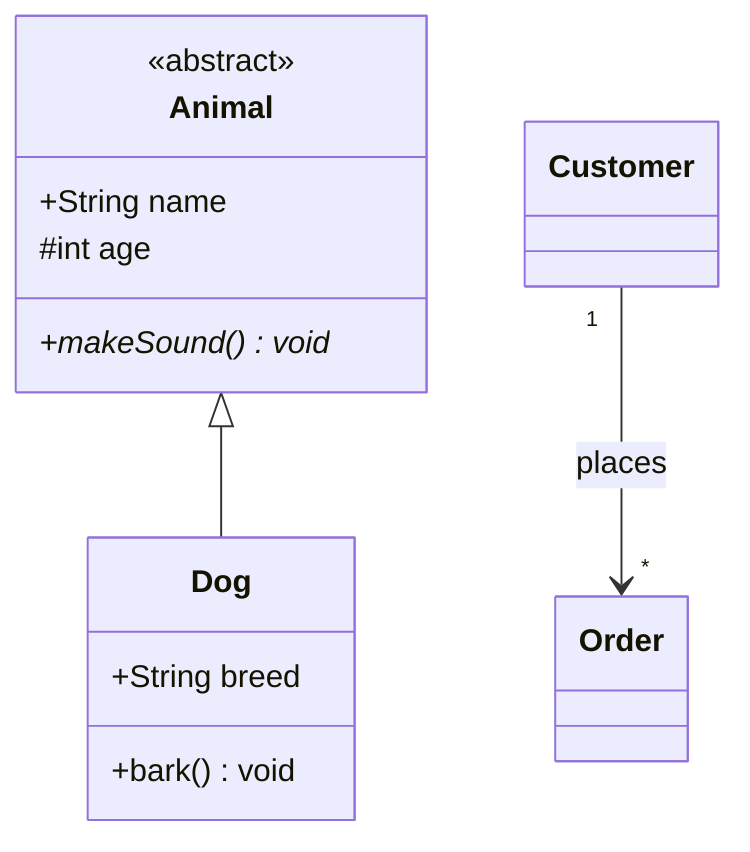
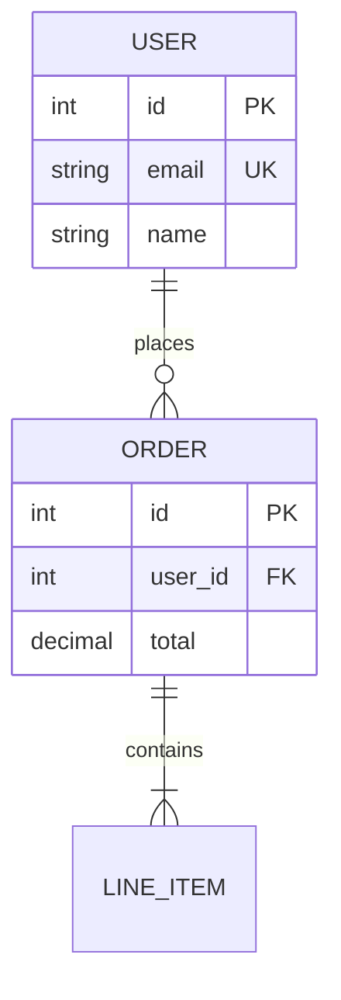

Craft Agent renders 8 special code-block types as rich interactive widgets. This skill
teaches you when and how to use each one. The core principle: whenever content has
structure — tables, flows, relationships, diffs, files — use the matching rich block
instead of plain text.

---

## Block Type Decision Tree

```
Structured/tabular data?
├─ YES → Rows < 20?
│  ├─ YES → Need xlsx export? → spreadsheet : datatable
│  └─ NO  → Use "src" file reference
├─ NO → continue
│
Flows, architecture, relationships?
├─ YES → mermaid (pick diagram type)
├─ NO → continue
│
Before/after code changes?
├─ YES → diff
├─ NO → continue
│
Structured JSON/config?
├─ YES → json (collapsible tree)
├─ NO → continue
│
References local files?
├─ .html → html-preview
├─ .png/.jpg/.gif/.webp/.svg → image-preview
├─ .pdf → pdf-preview
├─ NO → continue
│
Everything else → Standard GFM
```

**Mix blocks freely.** A strong report combines mermaid for architecture, datatable for
metrics, bullet points for takeaways, and diff for proposed changes — all in one output.

---

## 1. `datatable` — Interactive Data Table

Sortable, filterable, groupable. The workhorse for structured data.

````
```datatable
{
  "title": "Optional Title",
  "columns": [
    { "key": "name",    "label": "Name",    "type": "text" },
    { "key": "revenue", "label": "Revenue", "type": "currency" },
    { "key": "growth",  "label": "Growth",  "type": "percent" },
    { "key": "active",  "label": "Active",  "type": "boolean" },
    { "key": "tier",    "label": "Tier",    "type": "badge" },
    { "key": "date",    "label": "Date",    "type": "date" }
  ],
  "rows": [
    { "name": "Acme Corp", "revenue": 4200000, "growth": 0.152, "active": true, "tier": "Enterprise", "date": "2025-01-15" }
  ]
}
```
````

### Column Types

| Type | Input | Renders As | Example |
|------|-------|------------|---------|
| `text` | String | Plain text | `"John"` → John |
| `number` | Number | Comma-formatted | `1500000` → 1,500,000 |
| `currency` | Raw number | Dollar amount | `4200000` → $4,200,000 |
| `percent` | Decimal 0–1 | Colored % | `0.152` → +15.2% (green) |
| `boolean` | `true`/`false` | Yes / No | `true` → Yes |
| `date` | `YYYY-MM-DD` | Formatted date | `"2025-01-15"` → Jan 15, 2025 |
| `badge` | String | Colored pill | `"Active"` → green pill |

**Badge colors** (case-insensitive):
- **Green:** active, passing, success, done, connected, enabled, approved, completed
- **Red:** revoked, failed, error, cancelled, disabled, rejected, blocked
- **Gray:** Everything else (pending, draft, unknown, custom strings)

**datatable vs markdown table:** Use markdown tables for ≤ 4 rows of simple text.
Use datatable when you need sorting/filtering, typed columns, or > 4 rows.

---

## 2. `spreadsheet` — Excel-style Grid with Export

Like datatable but with row/column headers and `.xlsx` download. Choose when users
need export or the context is financial/accounting.

````
```spreadsheet
{
  "filename": "q4-revenue.xlsx",
  "sheetName": "Revenue",
  "columns": [
    { "key": "month",   "label": "Month",   "type": "text" },
    { "key": "revenue", "label": "Revenue", "type": "currency" },
    { "key": "cost",    "label": "Cost",    "type": "currency" },
    { "key": "margin",  "label": "Margin",  "type": "percent" }
  ],
  "rows": [
    { "month": "October",  "revenue": 125000, "cost": 80000, "margin": 0.36 },
    { "month": "November", "revenue": 142000, "cost": 75000, "margin": 0.47 }
  ]
}
```
````

Column types: `text`, `number`, `currency`, `percent`, `formula`.

---

## 3. `mermaid` — Diagrams

Rendered as themed SVGs. Supports flowcharts, sequence, state, class, and ER diagrams.

**Layout rule:** Default to `graph LR` (horizontal). Craft's UI renders horizontal
diagrams much better. Only use `TD` for inherently vertical hierarchies.

### 3.1 Flowcharts

````

````

**Node shapes:** `[text]` rectangle, `(text)` rounded, `{text}` diamond, `([text])` stadium, `((text))` circle, `[[text]]` subroutine, `[(text)]` cylinder, `{{text}}` hexagon, `>text]` flag, `[/text\]` trapezoid.

**Arrows:** `-->` solid, `---` line, `-.->` dotted, `==>` thick, `<-->` bidirectional, `-->|label|` labeled.

**Subgraphs & styling:**


**Chaining:** `A --> B --> C --> D` and `A & B --> C & D` both work.

### 3.2 Sequence Diagrams

````

````

**Messages:** `->>` solid, `-->>` dotted, `-)` async, `-x` lost.
**Activation:** `+` activates, `-` deactivates.
**Blocks:** `loop`, `alt/else`, `opt`, `par/and`, `Note over/right of/left of`.

### 3.3 State Diagrams

````

````

### 3.4 Class Diagrams

````

````

**Visibility:** `+` public, `-` private, `#` protected, `~` internal.
**Relations:** `<|--` inheritance, `*--` composition, `o--` aggregation, `-->` association, `..>` dependency, `..|>` realization.

### 3.5 ER Diagrams

````

````

**Cardinality:** `||` exactly one, `o|` zero or one, `|{` one or more, `o{` zero or more.

### Mermaid Tips

- One concept per diagram — split complex diagrams into two
- Descriptive edge labels, not just `A --> B`
- Quote special chars: `A["Label with (parens)"]`

---

## 4. `json` — Collapsible JSON Tree

Renders deeply nested data as an interactive collapsible tree. Use for metadata,
config snapshots, API response previews.

````
```json
{
  "project": {
    "name": "craft-agent",
    "version": "0.7.3",
    "dependencies": { "electron": "^33.0.0", "react": "^19.0.0" }
  }
}
```
````

---

## 5. `diff` — Code Diff Viewer

Unified diff format with syntax-highlighted additions/removals. Use for proposed
changes, version comparisons, before/after modifications.

````
```diff
--- a/config.ts
+++ b/config.ts
@@ -12,7 +12,7 @@
 export const config = {
-  timeout: 5000,
+  timeout: 10000,
   retries: 3,
+  backoff: "exponential",
 }
```
````

---

## 6–8. File Previews (`html-preview`, `image-preview`, `pdf-preview`)

All three file preview blocks share the same JSON schema. They render local files
inline with an expand-to-fullscreen button.

### Single file

````
```<block-type>
{
  "src": "/absolute/path/to/file",
  "title": "Display Title"
}
```
````

### Multiple files (tabs)

````
```<block-type>
{
  "title": "Tab Group Title",
  "items": [
    { "src": "/path/to/file1", "label": "Tab 1" },
    { "src": "/path/to/file2", "label": "Tab 2" }
  ]
}
```
````

Replace `<block-type>` with one of:

| Block | File Types | Notes |
|-------|-----------|-------|
| `html-preview` | `.html` | Sandboxed iframe; JS blocked, CSS works |
| `image-preview` | PNG, JPG, GIF, WebP, SVG, BMP, ICO, AVIF | 400px inline, expandable |
| `pdf-preview` | `.pdf` | Shows first page, full pagination in fullscreen |

**Rules for all file previews:**
- `src` must be an absolute path to an actual file on disk
- Use multi-item tabs for related files (before/after, thread, series)
- Only use when referencing real files — don't create files just to preview them

For `html-preview` specifically: only use when the user wants to see rendered HTML
with its original styling. Convert simple text content to markdown instead.

---

## Large Datasets: File-Backed Tables

When a datatable or spreadsheet has 20+ rows, use `"src"` to reference a JSON file
instead of inlining all data:

````
```datatable
{
  "src": "/absolute/path/to/data.json",
  "title": "Transaction History",
  "columns": [
    { "key": "date",   "label": "Date",   "type": "date" },
    { "key": "amount", "label": "Amount", "type": "currency" },
    { "key": "status", "label": "Status", "type": "badge" }
  ]
}
```
````

The JSON file should contain `{ "rows": [...] }` or a bare array `[...]`.
Inline `columns` and `title` take precedence over file values.

Use `transform_data` to prepare JSON from raw API responses, CSVs, or multi-source joins.

---

## Standard GFM Reference

All standard GitHub Flavored Markdown works alongside rich blocks:

- **Headings:** `#` H1 through `####` H4
- **Inline:** `**bold**`, `*italic*`, `~~strike~~`, `` `code` ``
- **Lists:** `-` unordered, `1.` ordered, `- [x]`/`- [ ]` task lists
- **Blockquotes:** `> text` (nest with `>>`)
- **Horizontal rules:** `---`
- **Links:** `[text](url)`, raw URLs auto-linked
- **Code blocks:** Fenced with language tag for syntax highlighting
- **Tables:** Standard pipe tables (≤ 4 rows; use datatable beyond that)
- **Collapsible:**
  ```html
  <details>
  <summary>Click to expand</summary>
  Hidden content here.
  </details>
  ```

---

## Output Quality Principles

These guide how to make output look great in Craft:

1. **Rich blocks first.** Express data as datatable, flows as mermaid, structure as
   JSON — the visual result is dramatically better than prose descriptions.

2. **Mix blocks freely.** Combine multiple block types in one output for the best
   reading experience.

3. **Keep narrative lean.** Bullet points over paragraphs. H2 for major sections,
   H3 for subsections. No filler.

4. **datatable formatting:**
   - Raw numbers for `currency`/`percent` — the renderer formats them
   - Actual `true`/`false` booleans, not strings
   - Standard status words for correct badge colors

5. **mermaid formatting:**
   - Default `graph LR`, keep diagrams focused, descriptive edge labels

6. **File previews:**
   - Only for actual files on disk, always absolute paths
   - Multi-item tabs for related files

---

## Output Structure Template

```
# [Title]

## Key Takeaways
- Most important findings as bullet points

## Overview
Brief narrative (2-3 sentences max).

## [Domain-Specific Sections]

### Architecture / Flow
→ mermaid diagram

### Data / Metrics
→ datatable or spreadsheet

### Changes / Comparison
→ diff block

### Detailed Analysis
→ markdown with headings, lists, blockquotes

## Metadata
→ json block with structured summary
```

Adapt to fit content — skip irrelevant sections, add needed ones. The goal is
output that's both informative and visually rich.
