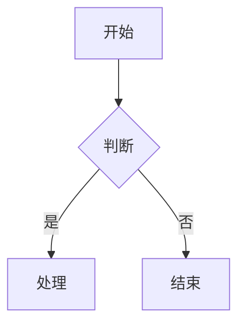

# 创建飞书云文档

通过 MCP 调用 `create-doc`，从 Lark-flavored Markdown 内容创建新的飞书云文档。

## 返回值

工具成功执行后返回 JSON 对象：
- `doc_id`（string）：文档唯一标识符
- `doc_url`（string）：文档访问链接
- `message`（string）：操作结果消息

---

## 参数

### markdown（必填）

文档的 Lark-flavored Markdown 内容。

内容应当结构清晰、样式丰富、可读性高。合理使用 callout 高亮块、分栏、表格等能力，并运用图片与 mermaid 做到图文并茂。

写作原则：
- **结构清晰**：标题层级不超过 4 层，用 Callout 突出关键信息
- **视觉节奏**：用分割线、分栏、表格打破大段纯文字
- **图文交融**：流程和架构优先用 Mermaid/PlantUML 可视化
- **克制留白**：Callout 不过度、加粗只强调核心词

当用户有明确的样式、风格需求时，以用户需求为准。

重要提示：
- **禁止重复标题**：markdown 内容开头不要写与 title 相同的一级标题，因为 title 参数已经是文档标题，markdown 应直接从正文内容开始
- **目录**：飞书自动生成，无需手动添加
- **长文档**：强烈建议配合 update-doc 的 append 模式分段创建，提高成功率
- **Markdown 语法**：必须符合 Lark-flavored Markdown 规范。完整语法参考见 [references/lark-markdown-syntax.md](references/lark-markdown-syntax.md)

### title（可选）

文档标题。

### folder_token（可选）

父文件夹 token。不提供则创建在个人空间根目录。

从飞书文件夹 URL 获取：`https://xxx.feishu.cn/drive/folder/fldcnXXXX` 中的 `fldcnXXXX`。

### wiki_node（可选）

知识库节点 token 或 URL。传入则在该节点下创建文档。与 folder_token 和 wiki_space 互斥。

从知识库页面 URL 获取：`https://xxx.feishu.cn/wiki/wikcnXXXX` 中的 `wikcnXXXX`。

### wiki_space（可选）

知识空间 ID。传入则在该空间根目录下创建文档。特殊值 `my_library` 表示个人知识库。与 wiki_node 和 folder_token 互斥。

从知识空间设置页面 URL 获取：`https://xxx.feishu.cn/wiki/settings/7448880953499959300` 中的数字 ID。

参数优先级：wiki_node > wiki_space > folder_token

---

## 示例

### 创建简单文档

```json
{
  "title": "项目计划",
  "markdown": "# 项目概述\n\n这是一个新项目。\n\n## 目标\n\n- 目标 1\n- 目标 2"
}
```

### 创建到指定文件夹

```json
{
  "title": "会议纪要",
  "folder_token": "fldcnXXXXXXXXXXXXXXXXXXXXXX",
  "markdown": "# 周会 2025-01-15\n\n## 讨论议题\n\n1. 项目进度\n2. 下周计划"
}
```

### 使用飞书扩展语法

```json
{
  "title": "产品需求",
  "markdown": "<callout emoji=\"💡\" background-color=\"light-blue\">\n重要需求说明\n</callout>\n\n## 功能列表\n\n<lark-table header-row=\"true\">\n| 功能 | 优先级 |\n|------|--------|\n| 登录 | P0 |\n| 导出 | P1 |\n</lark-table>"
}
```

### 创建到知识库节点下

```json
{
  "title": "技术文档",
  "wiki_node": "wikcnXXXXXXXXXXXXXXXXXXXXXX",
  "markdown": "# API 接口说明\n\n这是一个知识库文档。"
}
```

### 创建到知识空间根目录

```json
{
  "title": "项目概览",
  "wiki_space": "7448880953499959300",
  "markdown": "# 项目概览\n\n这是知识空间根目录下的一级文档。"
}
```

### 创建到个人知识库

```json
{
  "title": "学习笔记",
  "wiki_space": "my_library",
  "markdown": "# 学习笔记\n\n这是创建在个人知识库中的文档。"
}
```

---

## Lark Markdown 语法快速参考

完整的 Lark-flavored Markdown 语法参考见 [references/lark-markdown-syntax.md](references/lark-markdown-syntax.md)。

以下是最常用的飞书扩展语法速查：

### 高亮块（Callout）

```html
<callout emoji="💡" background-color="light-blue">
提示内容，支持**格式化**
</callout>
```

常用组合: 💡light-blue(提示) ⚠️light-yellow(警告) ❌light-red(危险) ✅light-green(成功)

限制: 子块仅支持文本、标题、列表、待办、引用。不支持代码块、表格、图片。

### 分栏（Grid）

```html
<grid cols="2">
<column>
左栏内容
</column>
<column>
右栏内容
</column>
</grid>
```

### 飞书增强表格（lark-table）

单元格需要复杂内容时使用。内容前后必须空行，每行 lark-td 数量必须相同。

```html
<lark-table column-widths="350,380" header-row="true">
<lark-tr>
<lark-td>

**表头1**

</lark-td>
<lark-td>

**表头2**

</lark-td>
</lark-tr>
<lark-tr>
<lark-td>

普通文本

</lark-td>
<lark-td>

- 列表项1
- 列表项2

</lark-td>
</lark-tr>
</lark-table>
```

### 图片

```html
<image url="https://example.com/image.png" width="800" height="600" align="center" caption="描述"/>
```

只支持 URL 方式（系统自动下载上传），不支持 token 属性。

### Mermaid 图表（优先使用）

````markdown

````

### 提及用户

```html
<mention-user id="ou_xxx"/>
```

不要直接写 `@张三`，应使用 search-user 获取 id 后使用 mention-user。

### 文字颜色

```html
<text color="red">红色文字</text>
<text background-color="yellow">黄色背景</text>
```

---

## 最佳实践

- **空行分隔**：不同块类型之间用空行分隔
- **转义字符**：特殊字符用 `\` 转义：`\*` `\~` `\``
- **图片**：使用 URL，系统自动下载上传
- **分栏**：列宽总和必须为 100
- **表格选择**：简单数据用 Markdown 表格，复杂嵌套用 `<lark-table>`
- **提及**：@用户用 `<mention-user>`，@文档用 `<mention-doc>`
- **目录**：飞书自动生成，无需手动添加
- 图片、画板、多维表格等以 token 形式存储，需要 URL（会自动上传转换）
- 完全兼容标准 Markdown
