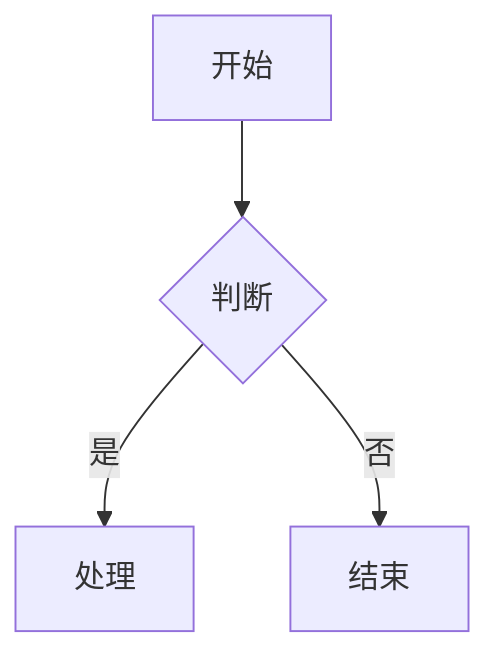
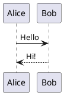

# Lark-flavored Markdown 语法参考

飞书文档内容使用 Lark-flavored Markdown，是标准 Markdown 的超集，通过自定义 XML 标签实现飞书特有功能。

## 通用规则

- 标准 Markdown 语法作为基础
- 自定义 XML 标签实现飞书扩展功能
- 特殊字符转义用反斜杠：`* ~ ` $ [ ] < > { } | ^`
- 不同块类型之间用空行分隔

---

## 基础块类型

### 文本（段落）

```markdown
普通文本段落

段落中的**粗体文字**

居中文本 {align="center"}
右对齐文本 {align="right"}
```

对齐支持 `{align="left|center|right"}`，可与颜色组合：`{color="blue" align="center"}`

### 标题

飞书支持 9 级标题。H1-H6 用标准 Markdown，H7-H9 用 HTML 标签：

```markdown
# 一级标题
## 二级标题
### 三级标题
#### 四级标题
##### 五级标题
###### 六级标题
<h7>七级标题</h7>
<h8>八级标题</h8>
<h9>九级标题</h9>

# 带颜色的标题 {color="blue"}
## 蓝色居中标题 {color="blue" align="center"}
```

颜色值：red, orange, yellow, green, blue, purple, gray。请谨慎使用。

### 列表

有序/无序列表嵌套使用 tab 或 2 空格缩进：

```markdown
- 无序项1
  - 无序项1.a

1. 有序项1
2. 有序项2

- [ ] 待办
- [x] 已完成
```

### 引用块

```markdown
> 这是一段引用
> 引用中支持**加粗**和*斜体*等格式
```

### 代码块

只支持围栏代码块（` ``` `），不支持缩进代码块。

````markdown
```python
print("Hello")
```
````

支持语言：python, javascript, go, java, sql, json, yaml, shell 等。

### 分割线

```markdown
---
```

---

## 富文本格式

### 文本样式

`**粗体**` `*斜体*` `~~删除线~~` `` `行内代码` `` `<u>下划线</u>`

### 文字颜色

`<text color="red">红色</text>` `<text background-color="yellow">黄色背景</text>`

支持: red, orange, yellow, green, blue, purple, gray

### 链接

`[链接文字](https://example.com)`（不支持锚点链接）

### 行内公式（LaTeX）

`$E = mc^2$`（`$`前后需空格）或 `<equation>E = mc^2</equation>`（无限制，推荐）

---

## 高级块类型

### 高亮块（Callout）

```html
<callout emoji="✅" background-color="light-green" border-color="green">
支持**格式化**的内容，可包含多个块
</callout>
```

属性: emoji (使用emoji字符如 ✅ ⚠️ 💡), background-color, border-color, text-color

背景色: light-red/red, light-blue/blue, light-green/green, light-yellow/yellow, light-orange/orange, light-purple/purple, pale-gray/light-gray/dark-gray

常用组合: 💡light-blue(提示) ⚠️light-yellow(警告) ❌light-red(危险) ✅light-green(成功)

限制: callout 子块仅支持文本、标题、列表、待办、引用。不支持代码块、表格、图片。

### 分栏（Grid）

适合对比、并列展示。支持 2-5 列：

```html
<grid cols="2">
<column>

左栏内容

</column>
<column>

右栏内容

</column>
</grid>
```

自定义宽度（百分比，总和为100）：

```html
<grid cols="3">
<column width="20">左栏(20%)</column>
<column width="60">中栏(60%)</column>
<column width="20">右栏(20%)</column>
</grid>
```

### 表格

#### 标准 Markdown 表格

```markdown
| 列 1 | 列 2 | 列 3 |
|------|------|------|
| 单元格 1 | 单元格 2 | 单元格 3 |
```

#### 飞书增强表格（lark-table）

当单元格需要复杂内容（列表、代码块、高亮块等）时使用。

层级结构（必须严格遵守）：
```
<lark-table> → <lark-tr> → <lark-td>内容</lark-td>
```

属性：
- `column-widths`：逗号分隔像素值，总宽约730
- `header-row`：首行是否为表头（`"true"/"false"`）
- `header-column`：首列是否为表头（`"true"/"false"`）

单元格写法（内容前后必须空行）：

```html
<lark-td>

这里写内容

</lark-td>
```

完整示例：

```html
<lark-table column-widths="200,250,280" header-row="true">
<lark-tr>
<lark-td>

**表头1**

</lark-td>
<lark-td>

**表头2**

</lark-td>
<lark-td>

**表头3**

</lark-td>
</lark-tr>
<lark-tr>
<lark-td>

普通文本

</lark-td>
<lark-td>

- 列表项1
- 列表项2

</lark-td>
<lark-td>

代码内容

</lark-td>
</lark-tr>
</lark-table>
```

限制：单元格内不支持 Grid 和嵌套表格。合并单元格仅读取时返回 `rowspan/colspan`，创建暂不支持。

禁止：混用 Markdown 表格语法（`|---|`）、使用 `<br/>` 换行、遗漏 `<lark-td>` 标签。

### 图片

```html
<image url="https://example.com/image.png" width="800" height="600" align="center" caption="图片描述"/>
```

属性: url (必需，系统自动下载上传), width, height, align (left/center/right), caption

不支持直接使用 `token` 属性（如 `<image token="xxx"/>`），只支持 URL 方式。支持 PNG/JPG/GIF/WebP/BMP，最大 10MB。

### 文件

```html
<file url="https://example.com/document.pdf" name="文档.pdf" view-type="1"/>
```

属性: url (必需), name (必需), view-type (1=卡片视图, 2=预览视图)

不支持直接使用 `token` 属性。

### 画板（Mermaid / PlantUML 图表）

Mermaid 图表会被渲染为可视化画板，应优先选择：

````markdown

````

支持: flowchart, sequenceDiagram, classDiagram, stateDiagram, gantt, mindmap, erDiagram

PlantUML 用于 Mermaid 满足不了的场景：

````markdown

````

支持: sequence, usecase, class, activity, component, state, object, deployment

读取时返回 `<whiteboard token="xxx" align="center" width="800" height="600"/>`。创建时用 Mermaid/PlantUML 代码块，禁止以 `<whiteboard>` 方式写入。

### 多维表格（Bitable）

```html
<bitable view="table"/>
<bitable view="kanban"/>
```

只能创建空的多维表格，创建后再手动添加数据。

### 会话卡片（ChatCard）

```html
<chat-card id="oc_xxx" align="center"/>
```

### 内嵌网页（Iframe）

```html
<iframe url="https://example.com/survey?id=123" type="12"/>
```

type 枚举: 1=Bilibili, 2=西瓜, 3=优酷, 4=Airtable, 5=百度地图, 6=高德地图, 8=Figma, 9=墨刀, 10=Canva, 11=CodePen, 12=飞书问卷, 13=金数据

仅支持上述网页类型。普通网页链接请使用 Markdown 链接格式 `[链接文字](URL)`。

### 引用容器（QuoteContainer）

```html
<quote-container>
引用容器内容
</quote-container>
```

与 quote 引用块不同，引用容器是容器类型，可包含多个子块。

---

## 高级功能块

### 电子表格（Sheet）

```html
<sheet rows="5" cols="5"/>
```

属性: rows (默认3，最大9), cols (默认3)。只能创建空表格。

### 只读块类型

| 块类型 | 标签 | 说明 |
|--------|------|------|
| 思维笔记 | `<mindnote token="xxx"/>` | 仅获取占位信息 |
| 流程图/UML | `<diagram type="1"/>` | type: 1=流程图, 2=UML |
| AI 模板 | `<ai-template/>` | 无内容占位块 |

### 任务块

```html
<task task-id="xxx" members="ou_123, ou_456" due="2025-01-01">任务标题</task>
```

### 同步块

```html
<!-- 源同步块 -->
<source-synced align="1">子块内容...</source-synced>

<!-- 引用同步块 -->
<reference-synced source-block-id="xxx" source-document-id="yyy">源内容...</reference-synced>
```

### 文档小组件（AddOns）

```html
<add-ons component-type-id="blk_xxx" record='{"key":"value"}'/>
```

旧版小组件（ISV）使用 `<isv id="comp_xxx" type="type_xxx"/>`。

### Wiki 子页面列表

```html
<sub-page-list wiki="wiki_xxx"/>
```

仅支持知识库文档，需传入当前页面的 wiki token。旧版 `<wiki-catalog token="wiki_xxx"/>` 已不推荐。

### 议程（Agenda）

```html
<agenda>
  <agenda-item>
    <agenda-title>议程标题</agenda-title>
    <agenda-content>议程内容</agenda-content>
  </agenda-item>
</agenda>
```

### Jira 问题

```html
<jira-issue id="xxx" key="PROJECT-123"/>
```

### OKR 系列

```html
<okr id="okr_xxx">
  <objective id="obj_1">
    <kr id="kr_1"/>
  </objective>
</okr>
```

仅支持 user_access_token 创建。

---

## 提及和引用

### 提及用户

```html
<mention-user id="ou_xxx"/>
```

不要直接在文档中写 `@张三`，应使用 search-user 获取用户 id 后使用 `mention-user`。

### 提及文档

```html
<mention-doc token="doxcnXXX" type="docx">文档标题</mention-doc>
```

type: docx/sheet/bitable

---

## 日期和时间

### 日期提醒（Reminder）

```html
<reminder date="2025-12-31T18:00+08:00" notify="true" user-id="ou_xxx"/>
```

属性: date (ISO 8601 带时区偏移, 必需), notify (true/false), user-id (创建者 ID, 必需)

---

## 数学表达式

### 块级公式

````markdown
$$
\int_{0}^{\infty} e^{-x^2} dx = \frac{\sqrt{\pi}}{2}
$$
````

### 行内公式

`$E = mc^2$`（`$` 前后需空格，紧邻位置不能有空格）

---

## 场景速查

| 场景 | 推荐组件 | 说明 |
|------|----------|------|
| 重点提示/警告 | Callout | 蓝色提示、黄色警告、红色危险 |
| 对比/并列展示 | Grid 分栏 | 2-3 列最佳，配合 Callout 更醒目 |
| 数据汇总 | 表格 | 简单用 Markdown，复杂嵌套用 lark-table |
| 步骤说明 | 有序列表 | 可嵌套子步骤 |
| 时间线/版本 | 有序列表 + 加粗日期 | 或用 Mermaid timeline |
| 代码展示 | 代码块 | 标注语言，适当添加注释 |
| 知识卡片 | Callout + emoji | 用于概念解释、小贴士 |
| 术语对照 | 两列表格 | 中英文、缩写全称等 |
