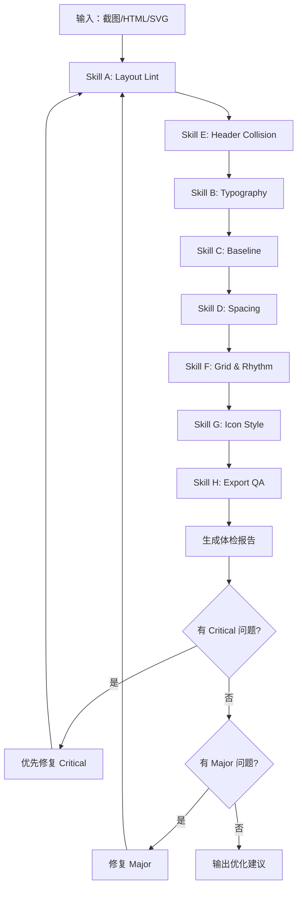

# 体检报告模板

## 完整体检流程



## 报告模板

```markdown
# Template Lint Report

**文件**：{filename}
**尺寸**：{width}×{height}
**检查时间**：{datetime}

## Summary

| 级别 | 数量 | 状态 |
|------|------|------|
| Critical | {n} | {status} |
| Major | {n} | {status} |
| Minor | {n} | {status} |

## Critical Issues

{critical_issues}

## Major Issues

{major_issues}

## Minor Issues / Suggestions

{minor_issues}

## 修复代码

{fix_code}

---

**检查项**：A B C D E F G H
**通过项**：{passed}
**待修复**：{failed}
```
